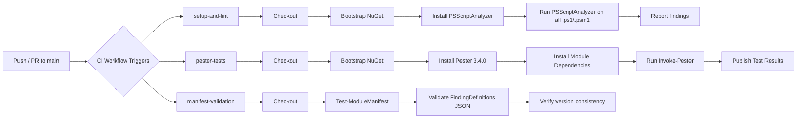

# Build & Validation Pipeline

| **Page Title**   | Build & Validation Pipeline                                |
|------------------|------------------------------------------------------------|
| **Last Updated** | 2026-02-15                                                 |
| **Status**       | NOT STARTED - No automated build pipeline exists           |
| **Owner**        | IntelliSecOps DevOps Team                                  |
| **Module**       | M365-SecurityAssessment v1.0.0                             |

---

## 1. Current State: Manual Build & Validation

> **STATUS: NOT STARTED** -- There is no automated build pipeline. All validation is performed manually on developer workstations.

### Current Manual Process

| Step | Action                              | Command / Method                                           | Frequency           |
|------|-------------------------------------|------------------------------------------------------------|---------------------|
| 1    | Clone or pull latest code           | `git pull origin main`                                     | Before each session |
| 2    | Import the module                   | `Import-Module ./M365-SecurityAssessment.psd1 -Force`      | On code change      |
| 3    | Run Pester tests                    | `Invoke-Pester -Path ./Tests/`                             | Before commit       |
| 4    | Validate module manifest            | `Test-ModuleManifest ./M365-SecurityAssessment.psd1`       | Occasionally        |
| 5    | Manual code review                  | Visual inspection of changed files                         | On PR (informal)    |
| 6    | Commit and push                     | `git add . && git commit && git push`                      | After validation    |

### Limitations of Current Approach

| Limitation                        | Risk                                                            | Impact   |
|-----------------------------------|-----------------------------------------------------------------|----------|
| No enforced test execution        | Tests may be skipped before commits                             | High     |
| No automated linting              | Code style inconsistencies and potential bugs go undetected     | Medium   |
| No manifest validation in CI      | Broken module manifest could be merged to main                  | High     |
| No JSON schema validation         | Malformed FindingDefinitions could break assessments            | Medium   |
| Dependency on developer discipline| Quality depends entirely on individual developer habits         | High     |

---

## 2. Recommended Build Workflow Diagram



> Export this Mermaid diagram as PNG and attach to the Confluence page for rendering.

---

## 3. Build Triggers (Recommended)

| Trigger Type     | Event                        | Branch/Path Filter                         | Condition / Notes                                   |
|------------------|------------------------------|--------------------------------------------|-----------------------------------------------------|
| **Pull Request** | `pull_request`               | Branches: `main`                           | Runs all 3 parallel jobs; blocks merge on failure   |
| **Push**         | `push`                       | Branches: `main`                           | Runs full validation on direct pushes               |
| **Manual**       | `workflow_dispatch`          | Any branch                                 | Allows on-demand validation of any branch           |
| **Schedule**     | `schedule` (weekly)          | `main`                                     | Weekly validation to catch dependency drift          |

---

## 4. Build Steps Breakdown (Recommended)

### Job 1: setup-and-lint

Runs PSScriptAnalyzer against all PowerShell source files to enforce code quality standards.

| #  | Step                           | Action / Tool                             | Purpose                                                      |
|----|--------------------------------|-------------------------------------------|--------------------------------------------------------------|
| 1  | Checkout code                  | `actions/checkout@v4`                     | Clone repository                                             |
| 2  | Bootstrap NuGet provider       | `Install-PackageProvider -Name NuGet`     | Required for `Install-Module` commands                       |
| 3  | Install PSScriptAnalyzer       | `Install-Module PSScriptAnalyzer -Force`  | PowerShell static analysis / linting tool                    |
| 4  | Run PSScriptAnalyzer           | `Invoke-ScriptAnalyzer -Path . -Recurse` | Analyze all `.ps1` and `.psm1` files                         |
| 5  | Fail on errors                 | Check for Error-level findings            | Block merge if critical code quality issues found            |

#### PSScriptAnalyzer Rules Configuration

| Rule Category      | Action on Finding | Notes                                           |
|--------------------|-------------------|-------------------------------------------------|
| Error              | Fail build        | Critical issues (e.g., `PSAvoidUsingPlainTextForPassword`) |
| Warning            | Report only       | Best practice violations (logged but non-blocking) |
| Information        | Report only       | Style suggestions                                |

#### Recommended Custom Rule Exclusions

| Rule Name                              | Reason for Exclusion                                       |
|----------------------------------------|------------------------------------------------------------|
| `PSUseShouldProcessForStateChangingFunctions` | Assessment module reads M365 state, rarely changes it |
| `PSAvoidUsingConvertToSecureStringWithPlainText` | Required for credential handling in test scenarios |

### Job 2: pester-tests

Runs the full Pester test suite (7 test files, 71+ tests) to validate assessment logic.

| #  | Step                           | Action / Tool                             | Purpose                                                      |
|----|--------------------------------|-------------------------------------------|--------------------------------------------------------------|
| 1  | Checkout code                  | `actions/checkout@v4`                     | Clone repository                                             |
| 2  | Bootstrap NuGet provider       | `Install-PackageProvider -Name NuGet`     | Required for module installation                             |
| 3  | Install Pester 3.4.0           | `Install-Module Pester -RequiredVersion 3.4.0 -Force` | Install exact Pester version for compatibility    |
| 4  | Install module dependencies    | `Install-Module` for each dependency      | Install all RequiredModules from manifest                    |
| 5  | Import module                  | `Import-Module ./M365-SecurityAssessment.psd1` | Load module under test                                  |
| 6  | Run Pester tests               | `Invoke-Pester -Path ./Tests/ -OutputFile results.xml -OutputFormat NUnitXml` | Execute all test files        |
| 7  | Publish test results           | Upload NUnit XML as artifact              | Preserve test results for review                             |

#### Test File Inventory

| Test File                          | Area Covered                              | Approximate Test Count |
|------------------------------------|-------------------------------------------|------------------------|
| `ControlsDB.Tests.ps1`            | Controls database operations (SQLite)     | ~10+                   |
| `EmailProtection.Tests.ps1`       | Email protection assessment logic         | ~10+                   |
| `InformationProtection.Tests.ps1` | Information protection controls           | ~10+                   |
| `M365Assessment.Tests.ps1`        | Core assessment orchestration             | ~10+                   |
| `ReportGeneration.Tests.ps1`      | Word/Excel report generation              | ~10+                   |
| `SecurityBaseline.Tests.ps1`      | Security baseline checks                  | ~10+                   |
| `TeamsProtection.Tests.ps1`       | Microsoft Teams security assessment       | ~10+                   |
| **Total**                          |                                           | **71+ tests**          |

### Job 3: manifest-validation

Validates the module manifest and supporting data files for structural correctness.

| #  | Step                           | Action / Tool                             | Purpose                                                      |
|----|--------------------------------|-------------------------------------------|--------------------------------------------------------------|
| 1  | Checkout code                  | `actions/checkout@v4`                     | Clone repository                                             |
| 2  | Validate module manifest       | `Test-ModuleManifest M365-SecurityAssessment.psd1` | Verify manifest parses correctly, all declared files exist |
| 3  | Validate FindingDefinitions    | PowerShell JSON parse script              | Parse each `.json` file in FindingDefinitions/; fail on invalid JSON |
| 4  | Verify exported functions      | Compare `FunctionsToExport` vs `Public/`  | Ensure all public functions are declared in manifest         |
| 5  | Check version consistency      | Compare `.psd1` ModuleVersion             | Verify version format is valid SemVer                        |

---

## 5. Dependency Installation Script (Recommended)

The following PowerShell script should be used as a CI step to install all required module dependencies:

```powershell
# install-dependencies.ps1
# Used by CI pipeline to install M365-SecurityAssessment module dependencies

[CmdletBinding()]
param()

$ErrorActionPreference = 'Stop'

# Bootstrap NuGet provider
Write-Host "Installing NuGet package provider..."
Install-PackageProvider -Name NuGet -MinimumVersion 2.8.5.201 -Force -Scope CurrentUser

# Set PSGallery as trusted to avoid prompts
Set-PSRepository -Name PSGallery -InstallationPolicy Trusted

# Define dependencies with minimum versions
$dependencies = @(
    @{ Name = 'Pester';                     RequiredVersion = '3.4.0' }
    @{ Name = 'PSScriptAnalyzer';           MinimumVersion  = '1.21.0' }
    @{ Name = 'Microsoft.Graph';            MinimumVersion  = '2.0.0' }
    @{ Name = 'ExchangeOnlineManagement';   MinimumVersion  = '3.0.0' }
    @{ Name = 'MicrosoftTeams';             MinimumVersion  = '5.0.0' }
    @{ Name = 'Pode';                       MinimumVersion  = '2.0.0' }
    @{ Name = 'PSSQLite';                   MinimumVersion  = '1.1.0' }
    @{ Name = 'PSWriteWord';                MinimumVersion  = '1.1.0' }
    @{ Name = 'ImportExcel';                MinimumVersion  = '7.0.0' }
)

foreach ($dep in $dependencies) {
    $installParams = @{
        Name  = $dep.Name
        Force = $true
        Scope = 'CurrentUser'
    }

    if ($dep.RequiredVersion) {
        $installParams['RequiredVersion'] = $dep.RequiredVersion
    }
    elseif ($dep.MinimumVersion) {
        $installParams['MinimumVersion'] = $dep.MinimumVersion
    }

    Write-Host "Installing $($dep.Name)..."
    Install-Module @installParams
}

Write-Host "All dependencies installed successfully."
```

---

## 6. Build Artifact Management (Recommended)

The CI workflow is primarily a validation pipeline and does not produce deployable artifacts. However, the following artifacts are recommended for retention:

| Artifact                    | Format         | Storage Location                 | Retention Policy   | Consumed By                |
|-----------------------------|----------------|----------------------------------|--------------------|----------------------------|
| Pester test results         | NUnit XML      | GitHub Actions Artifacts         | 30 days            | PR review, test dashboards |
| PSScriptAnalyzer report     | JSON / text    | GitHub Actions Artifacts         | 30 days            | Code review                |
| Module package (.zip)       | ZIP archive    | GitHub Actions Artifacts         | 90 days            | Release workflow           |

### Module Package Contents (for Release Builds)

```
M365-SecurityAssessment-v1.0.0.zip
  |-- M365-SecurityAssessment.psd1
  |-- M365-SecurityAssessment.psm1
  |-- Public/
  |     |-- *.ps1 (exported functions)
  |-- Private/
  |     |-- *.ps1 (internal functions)
  |-- FindingDefinitions/
  |     |-- *.json
  |-- Templates/
  |     |-- *.docx / *.xlsx
  |-- LICENSE
  |-- README.md
```

---

## 7. Build Matrix (Recommended)

| Axis                | Values                          | Notes                                                    |
|---------------------|---------------------------------|----------------------------------------------------------|
| Runtime version     | Windows PowerShell 5.1          | Primary target; module uses Windows-only cmdlets         |
| Operating system    | `windows-latest`                | Required for Microsoft.Graph and Exchange modules        |
| Pester version      | 3.4.0                          | Current test suite syntax requires Pester v3             |
| Configuration       | Single configuration            | No multi-configuration matrix needed currently           |

### Future Matrix Expansion

| Axis                | Additional Values               | When to Add                                              |
|---------------------|---------------------------------|----------------------------------------------------------|
| Runtime version     | PowerShell 7.x                  | When module is ported to cross-platform compatibility    |
| Pester version      | 5.x                            | When test suite is migrated from Pester v3 to v5 syntax |

---

## 8. Build Performance Targets (Recommended)

| Metric                          | Estimated Value     | Target              | Notes                                |
|---------------------------------|---------------------|---------------------|--------------------------------------|
| Total CI time (all jobs)        | ~8-15 min           | < 15 min            | Dependency install is the bottleneck |
| Dependency installation         | ~3-7 min            | < 5 min             | Module caching can reduce this       |
| PSScriptAnalyzer lint           | ~1-2 min            | < 2 min             | Fast for typical module size         |
| Pester test execution           | ~2-5 min            | < 5 min             | 71+ tests across 7 files            |
| Manifest validation             | ~30 sec             | < 1 min             | Very fast checks                     |

### Performance Optimization Checklist

- [ ] Module caching enabled (`actions/cache` for `$env:PSModulePath`)
- [ ] All 3 CI jobs run in parallel
- [ ] NuGet provider pre-installed on runner (skip bootstrap if available)
- [ ] PSGallery set as trusted repository to avoid interactive prompts
- [ ] Pester `-Tag` filtering available for targeted test runs

---

## 9. Failure Notification Strategy (Recommended)

| Failure Type                    | Notification Channel          | Recipients                      | Escalation                           |
|---------------------------------|-------------------------------|---------------------------------|--------------------------------------|
| PR build failure                | GitHub PR status check        | PR author                       | None (author must fix before merge)  |
| `main` branch build failure    | GitHub commit status          | Committer                       | Team reviews immediately             |
| PSScriptAnalyzer error findings | GitHub PR status check        | PR author                       | Must resolve before merge            |
| Pester test failure             | GitHub PR status check        | PR author                       | Must resolve before merge            |
| Weekly dependency check failure | GitHub Actions email          | DevOps team                     | Review in next sprint planning       |

---

## 10. Example GitHub Actions CI Workflow (Recommended)

```yaml
# .github/workflows/ci.yml
name: CI - M365 Security Assessment

on:
  pull_request:
    branches: [main]
  push:
    branches: [main]
  workflow_dispatch:

permissions:
  contents: read

jobs:
  setup-and-lint:
    name: PSScriptAnalyzer Lint
    runs-on: windows-latest
    steps:
      - name: Checkout
        uses: actions/checkout@v4

      - name: Bootstrap NuGet
        shell: pwsh
        run: |
          Install-PackageProvider -Name NuGet -MinimumVersion 2.8.5.201 -Force -Scope CurrentUser
          Set-PSRepository -Name PSGallery -InstallationPolicy Trusted

      - name: Install PSScriptAnalyzer
        shell: pwsh
        run: Install-Module PSScriptAnalyzer -Force -Scope CurrentUser

      - name: Run PSScriptAnalyzer
        shell: pwsh
        run: |
          $results = Invoke-ScriptAnalyzer -Path . -Recurse -ExcludeRule @(
            'PSUseShouldProcessForStateChangingFunctions'
          )
          $results | Format-Table -AutoSize
          $errors = $results | Where-Object { $_.Severity -eq 'Error' }
          if ($errors) {
            Write-Error "PSScriptAnalyzer found $($errors.Count) error-level findings."
            exit 1
          }

  pester-tests:
    name: Pester Tests
    runs-on: windows-latest
    steps:
      - name: Checkout
        uses: actions/checkout@v4

      - name: Bootstrap NuGet
        shell: pwsh
        run: |
          Install-PackageProvider -Name NuGet -MinimumVersion 2.8.5.201 -Force -Scope CurrentUser
          Set-PSRepository -Name PSGallery -InstallationPolicy Trusted

      - name: Install Pester 3.4.0
        shell: pwsh
        run: Install-Module Pester -RequiredVersion 3.4.0 -Force -Scope CurrentUser -SkipPublisherCheck

      - name: Install Module Dependencies
        shell: pwsh
        run: |
          $modules = @(
            'Microsoft.Graph',
            'ExchangeOnlineManagement',
            'MicrosoftTeams',
            'Pode',
            'PSSQLite',
            'PSWriteWord',
            'ImportExcel'
          )
          foreach ($mod in $modules) {
            Write-Host "Installing $mod..."
            Install-Module $mod -Force -Scope CurrentUser -AllowClobber
          }

      - name: Run Pester Tests
        shell: pwsh
        run: |
          Import-Module Pester -RequiredVersion 3.4.0
          $results = Invoke-Pester -Path ./Tests/ -OutputFile TestResults.xml -OutputFormat NUnitXml -PassThru
          if ($results.FailedCount -gt 0) {
            Write-Error "$($results.FailedCount) test(s) failed."
            exit 1
          }

      - name: Upload Test Results
        if: always()
        uses: actions/upload-artifact@v4
        with:
          name: pester-test-results
          path: TestResults.xml

  manifest-validation:
    name: Manifest & Data Validation
    runs-on: windows-latest
    steps:
      - name: Checkout
        uses: actions/checkout@v4

      - name: Validate Module Manifest
        shell: pwsh
        run: |
          $manifest = Test-ModuleManifest -Path ./M365-SecurityAssessment.psd1
          Write-Host "Module: $($manifest.Name)"
          Write-Host "Version: $($manifest.Version)"
          Write-Host "Exported Functions: $($manifest.ExportedFunctions.Keys -join ', ')"

      - name: Validate FindingDefinitions JSON
        shell: pwsh
        run: |
          $jsonFiles = Get-ChildItem -Path ./FindingDefinitions/ -Filter *.json -Recurse
          $failed = 0
          foreach ($file in $jsonFiles) {
            try {
              $null = Get-Content $file.FullName -Raw | ConvertFrom-Json
              Write-Host "PASS: $($file.Name)"
            } catch {
              Write-Error "FAIL: $($file.Name) - Invalid JSON: $_"
              $failed++
            }
          }
          if ($failed -gt 0) {
            Write-Error "$failed JSON file(s) failed validation."
            exit 1
          }
```

---

## 11. Appendix

### Related Pages

- [CI/CD Strategy Overview](./github-actions-overview.md)
- [Release & Distribution Pipeline](./release-pipeline.md)
- [Environment Strategy](./environment-strategy.md)
- [Test Strategy](../06-testing/test-strategy.md)
- [Unit Testing](../06-testing/unit-testing.md)
