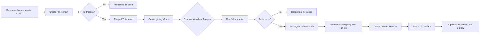

# Release & Distribution Pipeline

| **Page Title**   | Release & Distribution Pipeline                            |
|------------------|------------------------------------------------------------|
| **Last Updated** | 2026-02-15                                                 |
| **Status**       | IN PROGRESS - Manual release process; no automation        |
| **Owner**        | IntelliSecOps DevOps Team                                  |
| **Module**       | M365-SecurityAssessment v1.0.0                             |

---

## 1. Current State: Manual Release & Distribution

> **STATUS: IN PROGRESS** -- The module is distributed manually. Version is tracked in the module manifest but there is no automated release pipeline, no git tags, and no GitHub Releases.

### Current Release Process

| Step | Action                                  | Method                                                     | Performed By |
|------|-----------------------------------------|------------------------------------------------------------|--------------|
| 1    | Decide version bump                     | Manual decision based on scope of changes                  | Module lead  |
| 2    | Update ModuleVersion in `.psd1`         | Edit `M365-SecurityAssessment.psd1` manually               | Developer    |
| 3    | Run Pester tests locally                | `Invoke-Pester -Path ./Tests/`                             | Developer    |
| 4    | Commit version change                   | `git commit -m "Bump version to x.y.z"`                    | Developer    |
| 5    | Push to main                            | `git push origin main`                                     | Developer    |
| 6    | Notify consumers                        | Manual communication (email, Teams message)                | Module lead  |
| 7    | Consumer updates                        | `git pull origin main` then `Import-Module`                | Consumer     |

### Current Version Tracking

| Field                  | Location                              | Current Value   |
|------------------------|---------------------------------------|-----------------|
| `ModuleVersion`        | `M365-SecurityAssessment.psd1`        | `1.0.0`         |
| Git tags               | Not used                              | N/A             |
| GitHub Releases        | Not used                              | N/A             |
| Changelog              | Not maintained                        | N/A             |

### Limitations of Current Approach

| Limitation                          | Risk                                                          | Impact   |
|-------------------------------------|---------------------------------------------------------------|----------|
| No git tags for releases            | Cannot easily identify or revert to specific release versions | High     |
| No packaged artifacts               | Consumers must clone entire repository                        | Medium   |
| No changelog                        | Users cannot see what changed between versions                | Medium   |
| Manual notification to consumers    | Consumers may not know a new version is available             | Medium   |
| No validation before release        | Version could be bumped without passing tests                 | High     |
| No distribution beyond git clone    | Limits adoption; requires git access to repository            | Medium   |

---

## 2. Version Management

### Semantic Versioning (SemVer)

The module follows Semantic Versioning: `MAJOR.MINOR.PATCH`

| Component  | When to Increment                                                     | Example          |
|------------|-----------------------------------------------------------------------|------------------|
| **MAJOR**  | Breaking changes to exported function signatures, parameter changes, or removed functions | `2.0.0` |
| **MINOR**  | New assessment capabilities (new controls, new report types), new exported functions | `1.1.0` |
| **PATCH**  | Bug fixes in assessment logic, updated finding definitions, documentation fixes | `1.0.1` |

### Version Location in Module Manifest

```powershell
# M365-SecurityAssessment.psd1 (excerpt)
@{
    ModuleVersion     = '1.0.0'
    GUID              = '<module-guid>'
    Author            = 'IntelliSecOps'
    Description       = 'M365 Security Assessment Automation Module'
    RequiredModules   = @(
        'Microsoft.Graph',
        'ExchangeOnlineManagement',
        'MicrosoftTeams',
        'Pode',
        'PSSQLite',
        'PSWriteWord',
        'ImportExcel'
    )
    FunctionsToExport = @(...)
}
```

### Version Bump Examples

| Change Description                                     | Current Version | New Version | Bump Type |
|--------------------------------------------------------|-----------------|-------------|-----------|
| Add new Teams compliance assessment function           | 1.0.0           | 1.1.0       | MINOR     |
| Fix incorrect DMARC scoring logic                      | 1.1.0           | 1.1.1       | PATCH     |
| Update finding definitions with new CMMC controls      | 1.1.1           | 1.2.0       | MINOR     |
| Rename exported function parameters (breaking)         | 1.2.0           | 2.0.0       | MAJOR     |

---

## 3. Recommended Release Workflow Diagram



> Export this Mermaid diagram as PNG and attach to the Confluence page for rendering.

---

## 4. Recommended Release Process (Step by Step)

### Phase 1: Version Preparation

| Step | Action                                      | Command / Method                                          |
|------|---------------------------------------------|-----------------------------------------------------------|
| 1    | Determine version bump type                 | Review changes since last release (MAJOR, MINOR, PATCH)   |
| 2    | Update `ModuleVersion` in `.psd1`           | Edit `M365-SecurityAssessment.psd1`                       |
| 3    | Update changelog (if maintained)            | Add entry for new version with summary of changes         |
| 4    | Create PR with version bump                 | PR title: `Release v1.x.x`                               |
| 5    | CI validates the PR                         | Pester tests, PSScriptAnalyzer, manifest validation       |
| 6    | Merge PR to main                            | After review and CI passes                                |

### Phase 2: Tag and Release

| Step | Action                                      | Command / Method                                          |
|------|---------------------------------------------|-----------------------------------------------------------|
| 7    | Create annotated git tag                    | `git tag -a v1.x.x -m "Release v1.x.x"`                 |
| 8    | Push tag to origin                          | `git push origin v1.x.x`                                 |
| 9    | Release workflow triggers automatically     | On tag push matching `v*.*.*`                             |
| 10   | Workflow runs full test suite               | Pester tests + manifest validation                        |
| 11   | Workflow packages module as `.zip`          | Archive all module files with correct structure            |
| 12   | Workflow generates changelog                | Git log between previous tag and current tag               |
| 13   | Workflow creates GitHub Release             | With auto-generated release notes and `.zip` attachment   |

### Phase 3: Distribution (Optional)

| Step | Action                                      | Command / Method                                          |
|------|---------------------------------------------|-----------------------------------------------------------|
| 14   | Publish to private PowerShell Gallery       | `Publish-Module -Path . -NuGetApiKey $key -Repository PrivateGallery` |
| 15   | Notify consumers of new release             | GitHub Release notification (automatic for watchers)       |

---

## 5. Release Artifact Contents

### Module Package Structure

```
M365-SecurityAssessment-v1.0.0.zip
  |
  +-- M365-SecurityAssessment/
       |-- M365-SecurityAssessment.psd1     (module manifest)
       |-- M365-SecurityAssessment.psm1     (root module)
       |-- Public/
       |     |-- Invoke-M365Assessment.ps1
       |     |-- Get-SecurityBaseline.ps1
       |     |-- New-AssessmentReport.ps1
       |     |-- ... (all exported functions)
       |-- Private/
       |     |-- ... (internal helper functions)
       |-- FindingDefinitions/
       |     |-- *.json (CMMC control definitions)
       |-- Templates/
       |     |-- AssessmentReport.docx
       |     |-- FindingsMatrix.xlsx
       |     |-- ... (report templates)
       |-- LICENSE
       |-- README.md
```

### Artifact Naming Convention

```
M365-SecurityAssessment-v<MAJOR>.<MINOR>.<PATCH>.zip
```

Examples:
- `M365-SecurityAssessment-v1.0.0.zip`
- `M365-SecurityAssessment-v1.1.0.zip`
- `M365-SecurityAssessment-v2.0.0.zip`

---

## 6. Changelog Generation (Recommended)

### From Git History

The release workflow should generate a changelog from git commit history between the previous tag and the current tag.

```powershell
# Generate changelog between two tags
$previousTag = git describe --tags --abbrev=0 HEAD~1
$currentTag  = git describe --tags --abbrev=0 HEAD
$changelog   = git log "$previousTag..$currentTag" --pretty=format:"- %s (%h)" --no-merges

Write-Output "## What's Changed in $currentTag"
Write-Output ""
Write-Output $changelog
```

### Recommended Commit Message Categories

| Prefix      | Category               | Appears In Changelog As   |
|-------------|------------------------|---------------------------|
| `feat:`     | New feature            | New Features              |
| `fix:`      | Bug fix                | Bug Fixes                 |
| `control:`  | New/updated control    | Assessment Controls       |
| `finding:`  | Finding definition     | Finding Definitions       |
| `report:`   | Report template change | Report Templates          |
| `test:`     | Test additions/changes | Testing                   |
| `docs:`     | Documentation          | Documentation             |
| `chore:`    | Maintenance            | Maintenance               |

### Example Release Notes

```markdown
## M365-SecurityAssessment v1.1.0

### New Features
- feat: Add Teams meeting policy assessment (a3f8c1d)
- feat: Add conditional access policy evaluation (b2e9f4a)

### Assessment Controls
- control: Add CMMC AC.L2-3.1.1 finding definition (c4d7e2b)
- control: Update email protection scoring rubric (d5f8a3c)

### Bug Fixes
- fix: Correct DMARC record parsing for subdomains (e6a9b4d)
- fix: Handle null response from Get-MgUser gracefully (f7b0c5e)

### Testing
- test: Add Pester tests for Teams assessment functions (g8c1d6f)
```

---

## 7. GitHub Release Configuration (Recommended)

### Release Workflow Trigger

```yaml
on:
  push:
    tags:
      - 'v*.*.*'
```

### GitHub Release Settings

| Setting                     | Value                                               |
|-----------------------------|-----------------------------------------------------|
| Release title               | `M365-SecurityAssessment v<version>`                |
| Release body                | Auto-generated changelog from git history           |
| Attached assets             | `M365-SecurityAssessment-v<version>.zip`            |
| Pre-release flag            | Set for versions with `-beta`, `-rc` suffixes       |
| Draft flag                  | No (publish immediately on tag push)                |
| Discussion category         | None (private repository)                           |

---

## 8. Optional: Private PowerShell Gallery / NuGet Feed

### Why a Private Gallery

| Benefit                          | Description                                                       |
|----------------------------------|-------------------------------------------------------------------|
| Simplified installation          | `Install-Module M365-SecurityAssessment` from any workstation     |
| Version management               | `Update-Module` handles upgrades automatically                    |
| Dependency resolution            | PowerShellGet resolves RequiredModules automatically              |
| Access control                   | Private feed restricts access to authorized users only            |

### Private Gallery Options

| Option                           | Hosting                   | Cost           | Complexity |
|----------------------------------|---------------------------|----------------|------------|
| Azure DevOps Artifacts (NuGet)   | Azure DevOps              | Free (5GB)     | Low        |
| GitHub Packages (NuGet)          | GitHub                    | Included       | Low        |
| Self-hosted NuGet server         | On-premises or Azure VM   | Infrastructure | Medium     |
| ProGet (Inedo)                   | Self-hosted or cloud      | Free tier      | Medium     |

### Registration on Consumer Workstation

```powershell
# One-time setup on consumer workstation
Register-PSRepository -Name 'IntelliSecOps' `
    -SourceLocation 'https://pkgs.dev.azure.com/IntelliSecOps/_packaging/PowerShell/nuget/v2' `
    -InstallationPolicy Trusted

# Install the module
Install-Module M365-SecurityAssessment -Repository IntelliSecOps

# Update to latest version
Update-Module M365-SecurityAssessment
```

---

## 9. Rollback Procedure

### Current Rollback (Manual)

| Step | Action                                            | Command                                        |
|------|---------------------------------------------------|------------------------------------------------|
| 1    | Identify previous working commit                  | `git log --oneline`                            |
| 2    | Consumer checks out previous version              | `git checkout <previous-commit-sha>`           |
| 3    | Re-import module                                  | `Import-Module ./M365-SecurityAssessment.psd1` |

### Recommended Rollback (With Releases)

| Step | Action                                            | Command / Method                               |
|------|---------------------------------------------------|------------------------------------------------|
| 1    | Identify previous release version                 | GitHub Releases page or `git tag -l`           |
| 2    | Download previous release artifact                | Download `.zip` from GitHub Releases           |
| 3    | Extract and import                                | Unzip and `Import-Module`                      |
| **Or** | Install previous version from Gallery           | `Install-Module M365-SecurityAssessment -RequiredVersion 1.0.0` |

---

## 10. Example GitHub Actions Release Workflow (Recommended)

```yaml
# .github/workflows/release.yml
name: Release - M365 Security Assessment

on:
  push:
    tags:
      - 'v*.*.*'

permissions:
  contents: write

jobs:
  validate:
    name: Validate Release
    runs-on: windows-latest
    steps:
      - name: Checkout
        uses: actions/checkout@v4

      - name: Bootstrap NuGet
        shell: pwsh
        run: |
          Install-PackageProvider -Name NuGet -MinimumVersion 2.8.5.201 -Force -Scope CurrentUser
          Set-PSRepository -Name PSGallery -InstallationPolicy Trusted

      - name: Install Pester 3.4.0
        shell: pwsh
        run: Install-Module Pester -RequiredVersion 3.4.0 -Force -Scope CurrentUser -SkipPublisherCheck

      - name: Install Module Dependencies
        shell: pwsh
        run: |
          $modules = @(
            'Microsoft.Graph', 'ExchangeOnlineManagement', 'MicrosoftTeams',
            'Pode', 'PSSQLite', 'PSWriteWord', 'ImportExcel'
          )
          foreach ($mod in $modules) {
            Install-Module $mod -Force -Scope CurrentUser -AllowClobber
          }

      - name: Validate Module Manifest
        shell: pwsh
        run: |
          $manifest = Test-ModuleManifest -Path ./M365-SecurityAssessment.psd1
          $tagVersion = "${{ github.ref_name }}".TrimStart('v')
          if ($manifest.Version.ToString() -ne $tagVersion) {
            Write-Error "Tag version ($tagVersion) does not match manifest version ($($manifest.Version))."
            exit 1
          }
          Write-Host "Version validated: $tagVersion"

      - name: Run Pester Tests
        shell: pwsh
        run: |
          Import-Module Pester -RequiredVersion 3.4.0
          $results = Invoke-Pester -Path ./Tests/ -PassThru
          if ($results.FailedCount -gt 0) {
            Write-Error "$($results.FailedCount) test(s) failed. Release aborted."
            exit 1
          }
          Write-Host "All $($results.PassedCount) tests passed."

  package-and-release:
    name: Package and Create GitHub Release
    runs-on: windows-latest
    needs: validate
    steps:
      - name: Checkout
        uses: actions/checkout@v4
        with:
          fetch-depth: 0  # Full history for changelog generation

      - name: Extract Version
        id: version
        shell: pwsh
        run: |
          $version = "${{ github.ref_name }}".TrimStart('v')
          "VERSION=$version" | Out-File -FilePath $env:GITHUB_OUTPUT -Append
          Write-Host "Release version: $version"

      - name: Package Module
        shell: pwsh
        run: |
          $version = "${{ steps.version.outputs.VERSION }}"
          $packageName = "M365-SecurityAssessment-v$version"
          $stagingDir = "staging/$packageName/M365-SecurityAssessment"

          # Create staging directory
          New-Item -Path $stagingDir -ItemType Directory -Force

          # Copy module files
          $filesToCopy = @(
            'M365-SecurityAssessment.psd1',
            'M365-SecurityAssessment.psm1',
            'LICENSE',
            'README.md'
          )
          foreach ($file in $filesToCopy) {
            if (Test-Path $file) {
              Copy-Item $file -Destination $stagingDir
            }
          }

          # Copy directories
          $dirsToCopy = @('Public', 'Private', 'FindingDefinitions', 'Templates')
          foreach ($dir in $dirsToCopy) {
            if (Test-Path $dir) {
              Copy-Item $dir -Destination $stagingDir -Recurse
            }
          }

          # Create zip archive
          Compress-Archive -Path "staging/$packageName/*" -DestinationPath "$packageName.zip"
          Write-Host "Package created: $packageName.zip"

      - name: Generate Changelog
        id: changelog
        shell: pwsh
        run: |
          $previousTag = git describe --tags --abbrev=0 HEAD~1 2>$null
          if ($previousTag) {
            $log = git log "$previousTag..HEAD" --pretty=format:"- %s (%h)" --no-merges
          } else {
            $log = git log --pretty=format:"- %s (%h)" --no-merges -20
          }
          $changelog = "## What's Changed`n`n$log"
          $changelog | Out-File -FilePath CHANGELOG.md
          Write-Host $changelog

      - name: Create GitHub Release
        uses: softprops/action-gh-release@v2
        with:
          name: M365-SecurityAssessment v${{ steps.version.outputs.VERSION }}
          body_path: CHANGELOG.md
          files: M365-SecurityAssessment-v${{ steps.version.outputs.VERSION }}.zip
          draft: false
          prerelease: ${{ contains(github.ref_name, '-beta') || contains(github.ref_name, '-rc') }}
```

---

## 11. Implementation Roadmap

| Phase   | Milestone                                       | Priority  | Estimated Effort | Status       |
|---------|-------------------------------------------------|-----------|------------------|--------------|
| Phase 1 | Adopt git tag convention for releases           | High      | 1 hour           | NOT STARTED  |
| Phase 2 | Create release workflow (tag-triggered)          | High      | 4-6 hours        | NOT STARTED  |
| Phase 3 | Add changelog generation                        | Medium    | 2-3 hours        | NOT STARTED  |
| Phase 4 | Set up private PowerShell Gallery               | Low       | 6-8 hours        | NOT STARTED  |
| Phase 5 | Consumer documentation for Gallery installation | Low       | 2-3 hours        | NOT STARTED  |

---

## 12. Appendix

### Git Tag Quick Reference

```bash
# Create an annotated tag for release
git tag -a v1.1.0 -m "Release v1.1.0: Add Teams assessment"

# Push tag to remote
git push origin v1.1.0

# List all tags
git tag -l

# Delete a tag (local and remote) if release must be aborted
git tag -d v1.1.0
git push origin --delete v1.1.0
```

### Related Pages

- [CI/CD Strategy Overview](./github-actions-overview.md)
- [Build & Validation Pipeline](./build-pipeline.md)
- [Environment Strategy](./environment-strategy.md)
- [UAT Sign-Off](../06-testing/uat-signoff.md)
