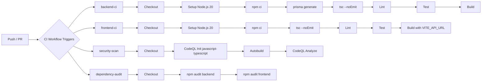

# Build Pipeline

| **Page Title**   | Build Pipeline                             |
|------------------|--------------------------------------------|
| **Last Updated** | 2026-02-14                                 |
| **Status**       | In Review                                  |
| **Owner**        | IntelliSecOps DevOps Team                  |

---

## 1. Build Workflow Diagram



> Export this Mermaid diagram as PNG and attach to the Confluence page for rendering.

---

## 2. Build Triggers

| Trigger Type    | Event                        | Branch/Path Filter                       | Condition / Notes                                 |
|-----------------|------------------------------|------------------------------------------|---------------------------------------------------|
| **Pull Request**| `pull_request`               | Branches: `main`, `develop`              | Runs all 4 parallel CI jobs; blocks merge on failure |
| **Push**        | `push`                       | Branches: `develop`                      | Runs full CI on integration branch                |
| **Manual**      | Not configured               | N/A                                      | CI does not support manual dispatch currently     |
| **Schedule**    | Not configured               | N/A                                      | No nightly builds configured yet                  |

---

## 3. Build Steps Breakdown

### Job 1: backend-ci

| #  | Step                         | Action / Tool                          | Purpose                                                   |
|----|------------------------------|----------------------------------------|-----------------------------------------------------------|
| 1  | Checkout code                | `actions/checkout@v4`                  | Clone repository                                          |
| 2  | Setup Node.js                | `actions/setup-node@v4`                | Install Node.js 20                                        |
| 3  | Install dependencies         | `npm ci`                               | Clean install of backend dependencies                     |
| 4  | Generate Prisma client       | `npx prisma generate`                  | Generate Prisma ORM client from schema                    |
| 5  | Type check                   | `tsc --noEmit`                         | TypeScript compilation check without emitting files       |
| 6  | Lint                         | ESLint                                 | Enforce code style and catch issues                       |
| 7  | Run tests                    | `npm test`                             | Execute test suite (if present)                           |
| 8  | Build                        | `npm run build`                        | Compile TypeScript to JavaScript                          |

### Job 2: frontend-ci

| #  | Step                         | Action / Tool                          | Purpose                                                   |
|----|------------------------------|----------------------------------------|-----------------------------------------------------------|
| 1  | Checkout code                | `actions/checkout@v4`                  | Clone repository                                          |
| 2  | Setup Node.js                | `actions/setup-node@v4`                | Install Node.js 20                                        |
| 3  | Install dependencies         | `npm ci`                               | Clean install of frontend dependencies                    |
| 4  | Type check                   | `tsc --noEmit`                         | TypeScript compilation check without emitting files       |
| 5  | Lint                         | ESLint                                 | Enforce code style and catch issues                       |
| 6  | Run tests                    | `npm test`                             | Execute test suite (if present)                           |
| 7  | Build                        | `npm run build`                        | Vite production build (with `VITE_API_URL` env var set)   |

### Job 3: security-scan

| #  | Step                         | Action / Tool                          | Purpose                                                   |
|----|------------------------------|----------------------------------------|-----------------------------------------------------------|
| 1  | Checkout code                | `actions/checkout@v4`                  | Clone repository                                          |
| 2  | Initialize CodeQL            | `github/codeql-action/init@v3`         | Initialize CodeQL for `javascript-typescript`             |
| 3  | Autobuild                    | `github/codeql-action/autobuild@v3`   | Automatically detect and build the project                |
| 4  | Perform CodeQL Analysis      | `github/codeql-action/analyze@v3`     | Run static analysis for security vulnerabilities          |

### Job 4: dependency-audit

| #  | Step                         | Action / Tool                          | Purpose                                                   |
|----|------------------------------|----------------------------------------|-----------------------------------------------------------|
| 1  | Checkout code                | `actions/checkout@v4`                  | Clone repository                                          |
| 2  | Audit backend dependencies   | `npm audit --audit-level=high`         | Check backend packages for known vulnerabilities          |
| 3  | Audit frontend dependencies  | `npm audit --audit-level=high`         | Check frontend packages for known vulnerabilities         |

---

## 4. Build Artifact Management

The CI workflow (`ci.yml`) does not produce persisted artifacts. Its purpose is validation only (type checking, linting, testing, security scanning). Deployable artifacts (Docker images) are produced by the CD workflow.

| Artifact              | Format                  | Storage Location                                    | Retention Policy     | Consumed By              |
|-----------------------|-------------------------|-----------------------------------------------------|----------------------|--------------------------|
| Backend Docker image  | OCI image               | Azure Container Registry (`acrcmmcassessorprod.azurecr.io`) | Latest + SHA tagged | CD deploy job            |
| Frontend Docker image | OCI image               | Azure Container Registry (`acrcmmcassessorprod.azurecr.io`) | Latest + SHA tagged | CD deploy job            |
| CodeQL SARIF results  | SARIF                   | GitHub Security tab                                 | Indefinite           | Security review          |

### Artifact Naming Convention (Docker Images)

```
acrcmmcassessorprod.azurecr.io/cmmc-assessor-backend:<short-sha>
acrcmmcassessorprod.azurecr.io/cmmc-assessor-backend:latest
acrcmmcassessorprod.azurecr.io/cmmc-assessor-frontend:<short-sha>
acrcmmcassessorprod.azurecr.io/cmmc-assessor-frontend:latest
```

---

## 5. Build Matrix

The project does not currently use a build matrix. All CI jobs target a single configuration:

| Axis              | Values                | Notes                                    |
|-------------------|-----------------------|------------------------------------------|
| Runtime version   | Node.js 20            | Single runtime version                   |
| Operating system  | `ubuntu-latest`       | Linux only (matches production containers)|
| Configuration     | Production build      | Single configuration                     |

---

## 6. Build Performance Metrics

| Metric                        | Current Value      | Target              | Notes                              |
|-------------------------------|--------------------|---------------------|------------------------------------|
| Total CI time (all jobs)      | ~5-8 min           | < 10 min            | 4 parallel jobs help keep total time low |
| Dependency install (npm ci)   | ~1-2 min           | < 2 min             | Per job                            |
| TypeScript type check         | ~30 sec            | < 1 min             | `tsc --noEmit`                     |
| CodeQL analysis               | ~3-5 min           | < 5 min             | Longest-running job typically      |
| Dependency audit              | ~30 sec            | < 1 min             | Fast npm audit checks              |

### Performance Optimization Checklist

- [ ] Dependency caching enabled (`actions/cache` or `actions/setup-node` with cache)
- [x] All 4 CI jobs run in parallel
- [ ] Path filters to skip unnecessary builds (not yet configured)
- [ ] Docker layer caching enabled (used in CD workflow with GHA cache)
- [ ] Larger GitHub-hosted runners for heavy builds (not needed currently)

---

## 7. Failure Notification Strategy

| Failure Type                  | Notification Channel          | Recipients                     | Escalation                          |
|-------------------------------|-------------------------------|--------------------------------|-------------------------------------|
| PR build failure              | GitHub PR status check        | PR author                      | None (author must fix)              |
| `develop` branch build failure| GitHub commit status           | Committer                     | Team reviews in next standup        |
| Security scan findings        | GitHub Security tab           | Security champion + team       | Per severity SLA                    |
| Dependency audit failure      | GitHub PR status check        | PR author                      | Must resolve high+ vulnerabilities  |

---

## 8. Example GitHub Actions CI Workflow

```yaml
# .github/workflows/ci.yml
name: CI

on:
  pull_request:
    branches: [main, develop]
  push:
    branches: [develop]

permissions:
  contents: read
  security-events: write

env:
  NODE_VERSION: '20'

jobs:
  backend-ci:
    name: Backend CI
    runs-on: ubuntu-latest
    defaults:
      run:
        working-directory: ./backend
    steps:
      - name: Checkout
        uses: actions/checkout@v4

      - name: Setup Node.js
        uses: actions/setup-node@v4
        with:
          node-version: ${{ env.NODE_VERSION }}

      - name: Install dependencies
        run: npm ci

      - name: Generate Prisma client
        run: npx prisma generate

      - name: Type check
        run: npx tsc --noEmit

      - name: Lint
        run: npm run lint

      - name: Test
        run: npm test

      - name: Build
        run: npm run build

  frontend-ci:
    name: Frontend CI
    runs-on: ubuntu-latest
    defaults:
      run:
        working-directory: ./frontend
    env:
      VITE_API_URL: http://localhost:3001
    steps:
      - name: Checkout
        uses: actions/checkout@v4

      - name: Setup Node.js
        uses: actions/setup-node@v4
        with:
          node-version: ${{ env.NODE_VERSION }}

      - name: Install dependencies
        run: npm ci

      - name: Type check
        run: npx tsc --noEmit

      - name: Lint
        run: npm run lint

      - name: Test
        run: npm test

      - name: Build
        run: npm run build

  security-scan:
    name: Security Scan (CodeQL)
    runs-on: ubuntu-latest
    permissions:
      security-events: write
    steps:
      - name: Checkout
        uses: actions/checkout@v4

      - name: Initialize CodeQL
        uses: github/codeql-action/init@v3
        with:
          languages: javascript-typescript

      - name: Autobuild
        uses: github/codeql-action/autobuild@v3

      - name: Perform CodeQL Analysis
        uses: github/codeql-action/analyze@v3

  dependency-audit:
    name: Dependency Audit
    runs-on: ubuntu-latest
    steps:
      - name: Checkout
        uses: actions/checkout@v4

      - name: Audit backend dependencies
        run: cd backend && npm audit --audit-level=high

      - name: Audit frontend dependencies
        run: cd frontend && npm audit --audit-level=high
```

---

## 9. Appendix

### Related Pages

- [GitHub Actions Overview](./github-actions-overview.md)
- [Release Pipeline](./release-pipeline.md)
- [Test Strategy](../06-testing/test-strategy.md)
- [Unit Testing](../06-testing/unit-testing.md)
