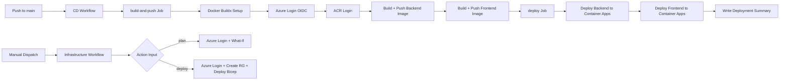

# Release Pipeline

| **Page Title**   | Release Pipeline                           |
|------------------|--------------------------------------------|
| **Last Updated** | 2026-02-14                                 |
| **Status**       | In Review                                  |
| **Owner**        | IntelliSecOps DevOps Team                  |

---

## 1. Release Workflow Diagram



> Export this Mermaid diagram as PNG and attach to the Confluence page for rendering.

---

## 2. Deployment Stages

### Current State

The CMMC Assessor Platform currently has a simplified two-stage pipeline. There is no staging environment yet.

```
  +---------+     +--------------+
  |  Build  | --> |  Production  |
  | (CD)    |     | (auto on     |
  |         |     |  push to     |
  |         |     |  main)       |
  +---------+     +--------------+
                       |
                  Container Apps
                  Deployment
```

| Stage           | Trigger                              | Approval Required | Smoke Tests     | Additional Validation            |
|-----------------|--------------------------------------|-------------------|-----------------|----------------------------------|
| **Build & Push**| Automatic on push to `main` or manual dispatch | No       | No              | Images tagged with SHA + latest  |
| **Production**  | Sequential after build-and-push      | No (automatic)    | Deployment summary written | Container Apps deploy action   |

### Planned: Three-Stage Pipeline

Once staging is set up, the pipeline will evolve to:

| Stage           | Trigger                              | Approval Required | Smoke Tests     | Additional Validation            |
|-----------------|--------------------------------------|-------------------|-----------------|----------------------------------|
| **Build & Push**| Automatic on push to `main`          | No                | No              | Image build and registry push    |
| **Staging**     | Automatic after build                | Yes (planned)     | Yes (planned)   | Integration tests, UAT           |
| **Production**  | Manual trigger after staging sign-off| Yes (planned)     | Yes (planned)   | Health check post-deploy         |

---

## 3. Deployment Strategy by Environment

| Environment   | Strategy         | Description                                                                                      | Rollback Method               |
|---------------|------------------|--------------------------------------------------------------------------------------------------|-------------------------------|
| **Development** | **Local Docker Compose** | Developers run `docker-compose up` locally with postgres:16-alpine, backend, frontend, adminer | Restart containers / rebuild  |
| **Production**| **Rolling (Container Apps)** | Azure Container Apps deploy action replaces the running revision with the new image. Scaling rules handle traffic (0-3 replicas). | Redeploy previous image tag   |
| **Staging**   | **Not yet configured** | Planned: Will mirror production Container Apps configuration                                  | Planned                       |

### Scaling Configuration (Production)

| Container App | CPU  | Memory | Min Replicas | Max Replicas | Scale Trigger               |
|---------------|------|--------|--------------|--------------|-----------------------------|
| `cmmc-api`    | 0.5  | 1Gi    | 0            | 3            | HTTP concurrent requests    |
| `cmmc-web`    | 0.25 | 0.5Gi  | 0            | 3            | HTTP concurrent requests    |

---

## 4. GitHub Actions Environment Protection Rules

### Current Configuration

| Environment   | Required Reviewers | Wait Timer  | Branch Policy | Custom Rules                     |
|---------------|--------------------|-------------|---------------|----------------------------------|
| **Production**| None (automatic)   | 0 min       | `main`        | Push to main triggers CD         |

### Planned Configuration

| Environment   | Required Reviewers    | Wait Timer  | Branch Policy | Custom Rules                     |
|---------------|-----------------------|-------------|---------------|----------------------------------|
| **Staging**   | 1 reviewer (planned)  | 0 min       | `main`        | Planned                          |
| **Production**| 2 reviewers (planned) | 5 min       | `main`        | Deployment window: weekdays only |

---

## 5. Azure Deployment Methods

| Target Platform              | Deployment Method                          | Tool / Action                                   | Notes                                           |
|------------------------------|--------------------------------------------|-------------------------------------------------|-------------------------------------------------|
| **Azure Container Apps**     | Deploy container revision                  | `azure/container-apps-deploy-action`            | Primary deployment target for backend + frontend|
| **Azure Container Registry** | Docker push to ACR                         | `docker/build-push-action@v6` + `azure/docker-login` | Images tagged with short SHA + latest      |
| **Infrastructure (IaC)**     | Bicep deployment                           | `az deployment group create` with `infra/main.bicep` | Manual dispatch only (plan or deploy)      |

### Authentication

All Azure deployments authenticate using **OIDC federation** via:

```yaml
- name: Azure Login
  uses: azure/login@v2
  with:
    client-id: ${{ secrets.AZURE_CLIENT_ID }}
    tenant-id: ${{ secrets.AZURE_TENANT_ID }}
    subscription-id: ${{ secrets.AZURE_SUBSCRIPTION_ID }}
```

---

## 6. Smoke Tests After Deployment

### Current State

Smoke tests are **not yet automated** in the CD pipeline. The deploy job writes a deployment summary to `GITHUB_STEP_SUMMARY` for manual verification.

### Planned Smoke Tests

| Environment   | Smoke Test Type            | Tool                             | Timeout  | Success Criteria                          |
|---------------|----------------------------|----------------------------------|----------|-------------------------------------------|
| **Staging**   | Health endpoint check      | `curl` in workflow step          | 2 min    | HTTP 200 from `/health` on backend        |
| **Production**| Health + API endpoint      | `curl` in workflow step          | 2 min    | HTTP 200 from backend health and frontend root |

### Smoke Test Failure Behavior (Planned)

- **Staging:** Block promotion to production; notify team.
- **Production:** Alert team; manual decision on rollback.

---

## 7. Rollback Automation

### Current State

Rollback is a **manual process**. To rollback production:

1. Identify the previous working image tag (Git SHA) from ACR.
2. Re-run the CD workflow targeting the previous commit, or manually update the Container App revision via Azure CLI.

### Manual Rollback via Azure CLI

```bash
# Rollback backend to a specific image tag
az containerapp update \
  --name cmmc-api \
  --resource-group rg-cmmc-assessor-prod \
  --image acrcmmcassessorprod.azurecr.io/cmmc-assessor-backend:<previous-sha>

# Rollback frontend to a specific image tag
az containerapp update \
  --name cmmc-web \
  --resource-group rg-cmmc-assessor-prod \
  --image acrcmmcassessorprod.azurecr.io/cmmc-assessor-frontend:<previous-sha>
```

### Planned: Automated Rollback Workflow

A dedicated `rollback.yml` workflow is planned for manual invocation:

```yaml
# .github/workflows/rollback.yml (planned)
name: Rollback Deployment

on:
  workflow_dispatch:
    inputs:
      service:
        description: 'Service to rollback'
        required: true
        type: choice
        options: [backend, frontend, both]
      image_tag:
        description: 'Image tag (SHA) to roll back to'
        required: true
        type: string
      reason:
        description: 'Reason for rollback'
        required: true
        type: string
```

---

## 8. Release Tagging and Versioning

### Current State

The project does not currently use formal semantic versioning or Git tags. Docker images are tagged with:
- **Short Git SHA** (e.g., `a3f8c1d`) for traceability
- **`latest`** for the most recent production build

### Planned Versioning Scheme

Adopt **Semantic Versioning (SemVer)**: `MAJOR.MINOR.PATCH`

| Component  | When to Increment                                       | Example          |
|------------|---------------------------------------------------------|------------------|
| **MAJOR**  | Breaking changes to API contracts                       | `2.0.0`          |
| **MINOR**  | New features (e.g., new CMMC assessment capabilities)   | `1.4.0`          |
| **PATCH**  | Bug fixes, security patches                             | `1.4.2`          |

### Planned Tagging Process

1. On merge to `main`, create a Git tag with the version number.
2. Create a GitHub Release with auto-generated release notes.
3. Tag Docker images with both the SemVer version and the Git SHA.

---

## 9. Deployment Notifications

### Current State

Deployment notifications are **not yet configured** beyond the `GITHUB_STEP_SUMMARY` output that the CD workflow writes.

### Planned Notifications

| Event                          | Channel                        | Message Content                                              |
|--------------------------------|--------------------------------|--------------------------------------------------------------|
| Deployment started             | GitHub Actions summary         | Environment, version, deployer, link to workflow run        |
| Deployment succeeded           | GitHub Actions summary         | Environment, image tags, duration                           |
| Deployment failed              | GitHub Actions (email)         | Environment, failure step, link to logs                     |
| Rollback triggered             | Team notification (planned)    | Environment, rolled-back-from, rolled-back-to, reason       |

---

## 10. Example CD Workflow

```yaml
# .github/workflows/cd.yml
name: CD

on:
  push:
    branches: [main]
  workflow_dispatch:

permissions:
  id-token: write
  contents: read

jobs:
  build-and-push:
    name: Build and Push Docker Images
    runs-on: ubuntu-latest
    steps:
      - name: Checkout
        uses: actions/checkout@v4

      - name: Set up Docker Buildx
        uses: docker/setup-buildx-action@v3

      - name: Azure Login (OIDC)
        uses: azure/login@v2
        with:
          client-id: ${{ secrets.AZURE_CLIENT_ID }}
          tenant-id: ${{ secrets.AZURE_TENANT_ID }}
          subscription-id: ${{ secrets.AZURE_SUBSCRIPTION_ID }}

      - name: ACR Login
        run: az acr login --name acrcmmcassessorprod

      - name: Build and Push Backend Image
        uses: docker/build-push-action@v6
        with:
          context: ./backend
          push: true
          tags: |
            acrcmmcassessorprod.azurecr.io/cmmc-assessor-backend:${{ github.sha }}
            acrcmmcassessorprod.azurecr.io/cmmc-assessor-backend:latest
          cache-from: type=gha
          cache-to: type=gha,mode=max

      - name: Build and Push Frontend Image
        uses: docker/build-push-action@v6
        with:
          context: ./frontend
          push: true
          tags: |
            acrcmmcassessorprod.azurecr.io/cmmc-assessor-frontend:${{ github.sha }}
            acrcmmcassessorprod.azurecr.io/cmmc-assessor-frontend:latest
          cache-from: type=gha
          cache-to: type=gha,mode=max

  deploy:
    name: Deploy to Azure Container Apps
    runs-on: ubuntu-latest
    needs: build-and-push
    steps:
      - name: Azure Login (OIDC)
        uses: azure/login@v2
        with:
          client-id: ${{ secrets.AZURE_CLIENT_ID }}
          tenant-id: ${{ secrets.AZURE_TENANT_ID }}
          subscription-id: ${{ secrets.AZURE_SUBSCRIPTION_ID }}

      - name: Deploy Backend Container App
        uses: azure/container-apps-deploy-action@v1
        with:
          containerAppName: cmmc-api
          resourceGroup: rg-cmmc-assessor-prod
          imageToDeploy: acrcmmcassessorprod.azurecr.io/cmmc-assessor-backend:${{ github.sha }}
          targetPort: 3001

      - name: Deploy Frontend Container App
        uses: azure/container-apps-deploy-action@v1
        with:
          containerAppName: cmmc-web
          resourceGroup: rg-cmmc-assessor-prod
          imageToDeploy: acrcmmcassessorprod.azurecr.io/cmmc-assessor-frontend:${{ github.sha }}
          targetPort: 80

      - name: Deployment Summary
        run: |
          echo "## Deployment Summary" >> $GITHUB_STEP_SUMMARY
          echo "- **Backend:** cmmc-api deployed with image tag ${{ github.sha }}" >> $GITHUB_STEP_SUMMARY
          echo "- **Frontend:** cmmc-web deployed with image tag ${{ github.sha }}" >> $GITHUB_STEP_SUMMARY
          echo "- **Backend URL:** https://api.cmmc.intellisecops.com" >> $GITHUB_STEP_SUMMARY
          echo "- **Frontend URL:** https://cmmc.intellisecops.com" >> $GITHUB_STEP_SUMMARY
```

---

## 11. Appendix

### Related Pages

- [GitHub Actions Overview](./github-actions-overview.md)
- [Build Pipeline](./build-pipeline.md)
- [Environment Strategy](./environment-strategy.md)
- [UAT Sign-Off](../06-testing/uat-signoff.md)
